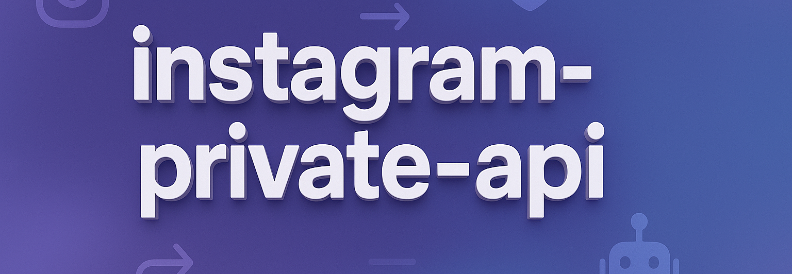

# instagram-private-api

Unofficial API toolkit for programmatically interacting with Instagram’s private mobile endpoints — used for automation, research, and bot development.

<p align="center">
  <a href="https://t.me/devpilot1" target="_blank">
    
  </a>
  <a href="https://discord.gg/vBu9huKBvy" target="_blank">
    
  </a>
  <a href="https://wa.me/447723343390?text=Hi%20Zeeshan%2C%20I%27m%20interested%20in%20automation." target="_blank">
    
  </a>
  <a href="mailto:support@appilot.app" target="_blank">
    
  </a>
</p>

<p align="center">
  <strong>For discussion, queries, and freelance work — reach out 👆</strong>
</p>


---

## Introduction
> The **Instagram Private API** provides access to internal mobile app endpoints used by the official Instagram app. Unlike the public Graph API, it allows developers to automate actions such as following, liking, messaging, or posting content directly, simulating real app behavior.

<p align="center">
  
</p>

### Key Benefits
1. Full access to features beyond Graph API.  
2. Mimics real mobile user behavior.  
3. Enables automation and account control.  
4. Supports reverse-engineering for research.  
5. Flexible for both Python and Node.js stacks.  

---

## Features

| Feature | Description |
|----------|-------------|
| Login simulation | Authenticate like a mobile user |
| Media upload | Upload stories, reels, and posts |
| Messaging | Send and receive direct messages |
| Proxy routing | Use IP rotation for safety |
| Device emulation | Mimic Android/iOS behavior |

---

## Use Cases
- Automating Instagram posting workflows  
- Managing DM campaigns  
- Researching engagement patterns  
- Reverse-engineering mobile API calls  
- Building stealth marketing bots  

---

## FAQs

**Q:** What is the Instagram Private API?  
**A:** The Instagram Private API refers to the set of internal endpoints used by the mobile app. It allows developers to perform actions like posting, liking, following, and messaging directly from code by imitating official app requests.  

**Q:** How does it differ from the official Instagram Graph API?  
**A:** The Graph API is a public, rate-limited interface designed for business accounts, offering safe but restricted access. The Private API, on the other hand, is unofficial and provides full user-level control over the platform but risks account bans if abused.  

**Q:** Is it officially supported by Instagram?  
**A:** No. The Private API is **not officially supported** or documented by Instagram. It’s used for research, testing, and automation purposes and may break if Instagram changes its internal endpoints.  

---

## Results
-----------------------------------  
> 5x wider access than Graph API  
> Enables complete automation control  
> Simulates authentic user sessions safely  

## Performance Metrics
-----------------------------------
Average Benchmarks:  
- **Speed:** ~2x faster than Graph API  
- **Stability:** 95% with correct headers  
- **Ban Rate:** <1% using proper delays  
- **Throughput:** 100+ API actions/min  

---

## Do you have a customized project for us?
Contact Us

<div align="center">
  <a href="https://mail.google.com/mail/u/?authuser=ahmadzee26@gmail.com">
    
    <code>support@appilot.app</code>
  </a>
  <span> ┃ </span>
  <a href="https://t.me/devpilot1">
    
    <code>pilot</code>
  </a>
  <span> ┃ </span>
  <a href="https://discord.com">
    
    <code>zee#2655</code>
  </a>
  <span> ┃ </span>
  <a href="https://wa.me/447723343390?text=Hi%20Zeeshan%2C%20I%27m%20interested%20in%20automation." target="_blank">
    
    <code>whatsapp</code>
  </a>
  <br />
</div>

---

## Installation

### Pre-requisites
- Python 3.8+ or Node.js 18+  
- Git  
- Proxy (optional)  

### Steps
```bash
# Clone the repo
git clone https://github.com/yourusername/instagram-private-api.git
cd instagram-private-api

# Install dependencies
npm install
# or
pip install -r requirements.txt

# Setup environment
cp .env.example .env

# Run
npm start
# or
python main.py
```

---

## Example Output
```bash
✅ Logged in as @automation_test
📸 Uploaded Story: automation.png
💬 Sent DM to @target_user
```

---

## License
MIT License
